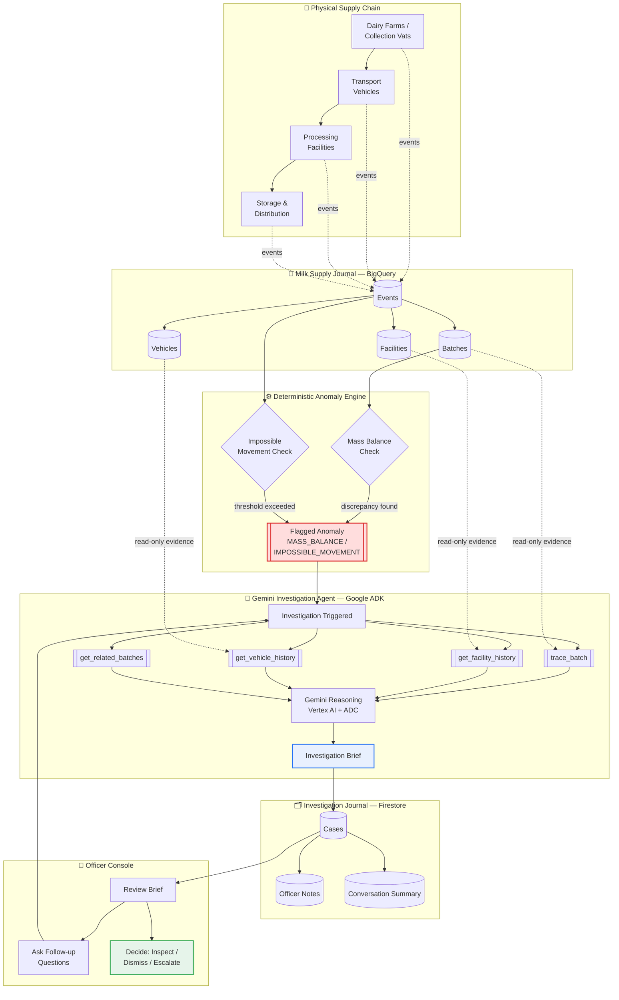
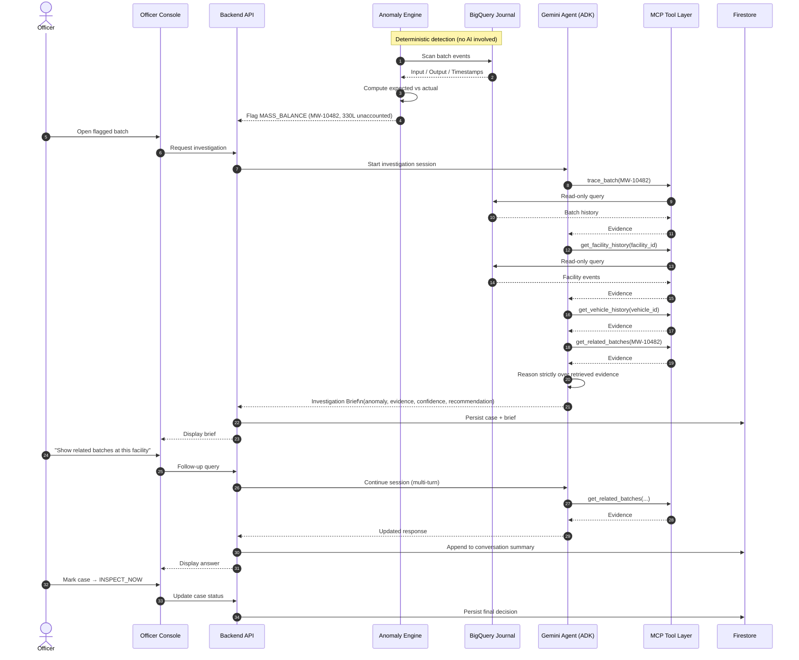
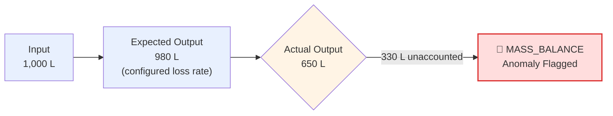

<div align="center">

#  MilkyWay
### Milk Supply-Chain Anomaly Detection & Investigation Platform

**Trace every litre. Find every discrepancy.**
*Know where to look — before you send an inspector.*

[](https://cloud.google.com/run)
[](https://ai.google.dev/)
[](https://cloud.google.com/)
[](https://cloud.google.com/vertex-ai)
[](https://firebase.google.com/products/firestore)
[](https://cloud.google.com/bigquery)
[](https://modelcontextprotocol.io/)
[](#license)

**Built for the Accelerate AI with Cloud Run Challenge**

<!--  -->
*(Suggested: add a banner screenshot of the Officer Console dashboard here)*

</div>

---


## 🔍 What is MilkyWay?

MilkyWay is an enterprise-grade **food-safety intelligence and supply-chain anomaly detection platform** built for Food Safety Officers.

Food adulteration is normally caught through lab testing — after the fact, on a small sample, with no idea where in the supply chain things actually went wrong. MilkyWay attacks the problem from the other direction: it turns every step a batch of milk takes — collection, transport, processing, storage, distribution — into a permanent, connected journal entry, then uses deterministic math and an evidence-grounded AI agent to tell officers **which batches are worth investigating first, and why.**

> MilkyWay doesn't decide what's true. It shows you where the story stops adding up — so a human investigator can find out.

---

## ⚠️ Critical Regulatory & Positioning Boundary

> **MilkyWay does NOT test milk, does NOT perform chemical laboratory analysis, and does NOT determine whether milk is adulterated.**
>
> Its sole purpose is to track the movement and quantity of milk through the physical supply chain, detect unexplained input/output mass discrepancies and impossible velocities, and help Food Safety Officers prioritize and deploy physical inspections with forensic evidence.
>
> **Actual adulteration testing happens only after an authorized authority conducts a physical inspection and laboratory testing.**

---

## 💡 The Core Idea

```
JOURNAL  →  TRACE  →  DETECT  →  INVESTIGATE  →  INSPECT
```

| Stage | What happens |
|---|---|
| **Journal** | Every supply-chain event (collection, transfer, processing, dispatch) becomes an immutable, structured entry |
| **Trace** | Batches are linked end-to-end across facilities, vehicles, and timestamps |
| **Detect** | A deterministic engine — no AI guesswork — flags mass-balance and movement anomalies |
| **Investigate** | A Gemini + Google ADK agent retrieves evidence through scoped, read-only MCP tools and compiles a grounded brief |
| **Inspect** | A human officer makes the final call, backed by a full evidence trail |

---

## 🏗 System Architecture



**Key design principle:** the AI never invents an anomaly and never touches the supply-chain database directly. It only *reasons over evidence retrieved through read-only MCP tools*, after a deterministic engine has already flagged a discrepancy.

```
Data → Deterministic Detection → Evidence Retrieval (MCP) → Gemini Reasoning → Investigation Brief
```

---

## 🔄 Investigation Sequence

The diagram below shows what happens end-to-end when a batch is flagged and an officer opens an investigation.



---

## 🧮 How Anomaly Detection Works

MilkyWay's MVP ships with two **deterministic** anomaly types — no LLM is ever asked to decide if something "looks suspicious."

### 1. Mass Balance

A processing facility receives a known input volume. Based on configured processing parameters (e.g. expected loss during chilling/processing), the engine calculates the expected output — and compares it against what was actually recorded.



**Example — Batch `MW-10482`:**

| Field | Value |
|---|---|
| Input | 1,000 L |
| Expected output | 980 L |
| Actual output | 650 L |
| Unaccounted | **330 L** |
| Flag | `MASS_BALANCE` |
| Recommended action | `INSPECT_NOW` |
| Evidence confidence | `HIGH` |

### 2. Impossible Movement

If a batch is recorded at one location and then appears at another shortly after, the engine calculates the implied transport speed from distance and elapsed time. Exceeding a configured plausible maximum flags `IMPOSSIBLE_MOVEMENT` — which could mean bad GPS data, a timestamp error, or something worth a closer look.

> Neither anomaly is proof of adulteration. Both are signals that the recorded story doesn't add up — which is exactly what an investigation is for.

---

## 🛡 Threat Model — The 5 Threat Zones

| Threat Zone | Identified Risk | Engineered Countermeasure |
|---|---|---|
| **1. Input Surfaces** | Malicious farmer payload, crafted weight ticket, prompt injection via free-text delivery notes | Strict schema validation (Zod); deterministic math runs upstream of the LLM; free-text notes are treated strictly as passive string data |
| **2. Planning & Reasoning** | Agent manipulated into skipping required MCP tools or hallucinating an adulteration finding | Deterministic state engine mandates the tool-invocation sequence; guardrails forbid non-evidenced diagnostic claims |
| **3. Tool Execution** | Privilege escalation via MCP tools (e.g. invoking `get_facility_history` outside an officer's jurisdiction) | Context-bound authorization token validated at the MCP server boundary; parameter validation on all facility/vehicle IDs |
| **4. Memory & State** | Cross-role data leak — e.g. a farmer discovering a confidential regional investigation dossier | Firestore security rules partition `/cases/` to authenticated officer claim lookups only |
| **5. Inter-System Comms** | BigQuery credential exposure; Gemini API token leaked in client bundle or network payload | All AI and BigQuery operations proxy through the Cloud Run backend; no client-side credentials, no embedded API keys |

**Design rule enforced throughout:** *no conclusion without evidence.* The agent must ground every claim in data retrieved through the MCP layer — it cannot fabricate a finding, and if Gemini is unavailable, the system reports `AI_UNAVAILABLE` rather than faking a result.

---

## 🧰 Tech Stack

| Layer | Technology |
|---|---|
| Frontend | React + TypeScript, Vite |
| Backend | Node.js / Bun, Cloud Run |
| Supply-chain journal | Google BigQuery |
| Investigation state | Firebase Firestore |
| Auth | Firebase Authentication (verified ID tokens, custom claims) |
| AI reasoning | Gemini (via Vertex AI) |
| Agent framework | Google ADK |
| Evidence access | Model Context Protocol (MCP) — read-only tools |
| Infra | Google Cloud Run, Secret Manager, IAM |

---

## 🖼 Screenshots

*(Add product screenshots or GIFs below — recommended: Officer Console dashboard, flagged batch view, investigation brief, multi-turn chat)*

<!--


-->

---

## 🚀 Getting Started

### Local Development

```bash
# 1. Install dependencies
npm install

# 2. Copy environment template
cp .env.example .env

# 3. Start the development server (port 3000)
npm run dev
```

Visit `http://localhost:3000` to preview the platform.

---

## ☁️ Cloud Infrastructure & Security Configuration

### Prerequisites

1. Install the [Google Cloud SDK (gcloud CLI)](https://cloud.google.com/sdk/docs/install).
2. Authenticate and set your active Google Cloud project:

```bash
gcloud auth login
gcloud config set project YOUR_PROJECT_ID
```

3. Enable required Google Cloud APIs:

```bash
gcloud services enable \
  run.googleapis.com \
  secretmanager.googleapis.com \
  firestore.googleapis.com \
  bigquery.googleapis.com
```

### Gemini via Vertex AI + ADC (no API key)

Production Gemini access uses **Vertex AI**, authenticated with **Application Default Credentials (ADC)** — the attached Cloud Run runtime service account. There is **no Gemini API key** and **no service-account JSON** anywhere in the codebase. The backend builds the client as `new GoogleGenAI({ vertexai: true, project, location })` (see `src/server/geminiAuth.ts` and `src/server/geminiClient.ts`).

- Project: `YOUR_PROJECT_ID`
- Location: `GEMINI_LOCATION` (default `us-central1`)
- Model: `GEMINI_MODEL` (default `gemini-2.5-flash`)

If Vertex AI is unavailable, the backend returns `AI_UNAVAILABLE` and never fabricates output.

> **Why ADC instead of a Secret Manager–stored API key?** The challenge's "Secure Key Management" requirement asks for keys to be retrieved via Secret Manager rather than hardcoded. MilkyWay goes a step further: production Gemini access uses Vertex AI + Application Default Credentials, so there is **no long-lived API key to store, retrieve, rotate, or leak at all** — the Cloud Run runtime service account's identity *is* the credential. This removes an entire class of key-management risk rather than just guarding it. Secret Manager is still wired in (`src/server/secretProvider.ts`) and used for any genuine future secrets the app needs.

```bash
PROJECT_ID=YOUR_PROJECT_ID
RUNTIME_SA="milkyway-run@${PROJECT_ID}.iam.gserviceaccount.com"

# Enable Vertex AI
gcloud services enable aiplatform.googleapis.com --project="$PROJECT_ID"

# Create the runtime service account (once)
gcloud iam service-accounts create milkyway-run \
  --display-name="MilkyWay Cloud Run runtime" --project="$PROJECT_ID"

# Vertex AI access (least privilege) — the ONLY role needed for Gemini
gcloud projects add-iam-policy-binding "$PROJECT_ID" \
  --member="serviceAccount:${RUNTIME_SA}" \
  --role="roles/aiplatform.user"
```

The runtime service account also needs Firebase/Firestore access for token verification, custom claims, and case persistence (e.g. `roles/datastore.user` and `roles/firebaseauth.admin`) — never broad project Owner/Editor. No `roles/secretmanager.secretAccessor` is required for Gemini anymore.

> Secret Manager remains available for genuine future secrets (`src/server/secretProvider.ts`), but is no longer used to store a Gemini API key.

### Application Default Credentials (ADC)

No JSON service-account key is stored in the repository. Authentication uses ADC:

- **Cloud Run**: the attached runtime service account identity (above).
- **Local development** (uses Vertex AI by default):

```bash
gcloud auth application-default login
gcloud config set project YOUR_PROJECT_ID
```

Optionally, set `GEMINI_API_KEY` in `.env` and leave `GEMINI_USE_VERTEX` unset to use the Gemini Developer API locally instead of Vertex AI. Production never uses a key.

### Firestore Security Rules

The authoritative, claim-based rules live in [`firestore.rules`](./firestore.rules) and are machine-verifiable via the emulator (`npm run test:rules`). Roles come from verified Firebase custom claims (`request.auth.token.role`), never from client-writable documents.

---

## 🚢 Cloud Run Deployment

```bash
# Build and deploy service
gcloud run deploy milkyway-platform \
  --source . \
  --region us-central1 \
  --platform managed \
  --allow-unauthenticated \
  --service-account="milkyway-run@YOUR_PROJECT_ID.iam.gserviceaccount.com" \
  --set-env-vars="NODE_ENV=production" \
  --min-instances=1 \
  --memory=1Gi \
  --port=3000
```

### Verification Binding Label

To register the service for automated challenge verification, apply the mandatory resource label:

```bash
gcloud run services update milkyway-platform \
  --update-labels=dev-tutorial=cloud-run-ai-challenge \
  --region=us-central1
```

---

## ✅ Testing & Verification Protocol

1. **Mass-Balance Determinism** — Verify that adjusting scenario inputs computes exact arithmetic shortfalls (`Input − Loss − Output`) without calling any LLM endpoint.
2. **Investigation Synthesis** — Verify that clicking *Re-Run Investigation Sequence* iterates sequentially across the MCP tools before presenting the structured brief.
3. **Non-Diagnostic Compliance** — Confirm that all outputs use terms such as *investigation signal*, *unexplained discrepancy*, and *prioritize physical inspection* — never an unauthorized diagnostic claim of adulteration.

### Firestore Security Rules — Emulator Verification

The real `firestore.rules` are machine-verified with `@firebase/rules-unit-testing` against the Firebase Firestore Emulator (no mocked authorization).

**Prerequisites:**
- A Java runtime (JDK 11+) — the Firestore emulator is a Java application.
- `firebase-tools` (installed as a devDependency).

```bash
npm run test:rules
```

This launches the Firestore emulator via `firebase emulators:exec` and executes `src/server/firestoreRules.emulator.test.ts`, which asserts — using authenticated contexts with custom claims (`officerA` / `officerB` / `admin`) — that:

- users cannot change their own `role`/`uid` or self-promote to `ADMIN`
- officers can only read/update their own or shared cases (no `assignedOfficerUid` hijack)
- officer notes, chat summaries, and alerts are owner-isolated
- admin has the intended elevated access

Other suites (no Java required):

```bash
npm test            # anomaly engine, MCP, agent, auth, cross-user isolation
npm run lint         # tsc --noEmit
```

---

## 🗺 Roadmap

- [ ] Historical anomaly pattern analysis
- [ ] Facility-level risk scoring
- [ ] Vehicle route analysis
- [ ] Cross-batch correlation
- [ ] Additional supply-chain event types
- [ ] Laboratory-result integration
- [ ] Human feedback loops on closed cases
- [ ] Offline-first supply journal entry
- [ ] Finer-grained supplier/facility access control
- [ ] Learn from previously resolved investigations

> The next step isn't "add more AI." It's better evidence — an investigation is only as good as the trail behind it.

---

## 🏆 Built With

**Google Cloud Run** · **Google ADK** · **Gemini** · **Vertex AI** · **MCP** · **BigQuery** · **Firebase Authentication** · **Firestore** · **React / TypeScript**

Built as part of the **Accelerate AI with Cloud Run** challenge.

---

## 📄 License

MIT — see [LICENSE](./LICENSE) for details.

<div align="center">

**🥛 Trace every litre. Find every discrepancy.**

</div>
